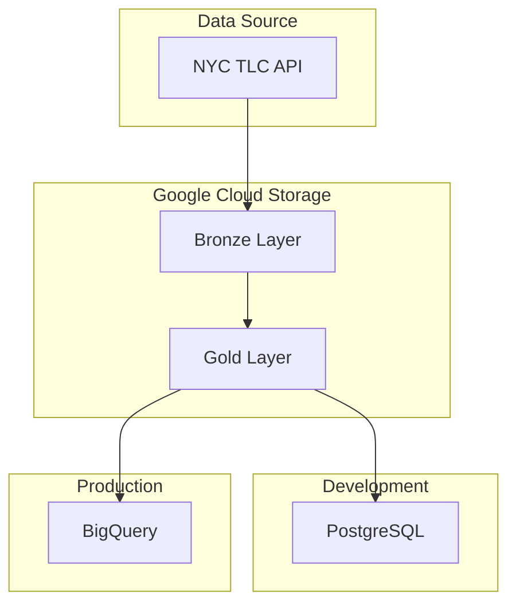
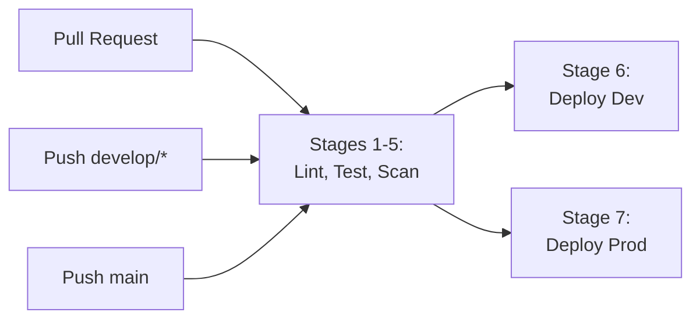
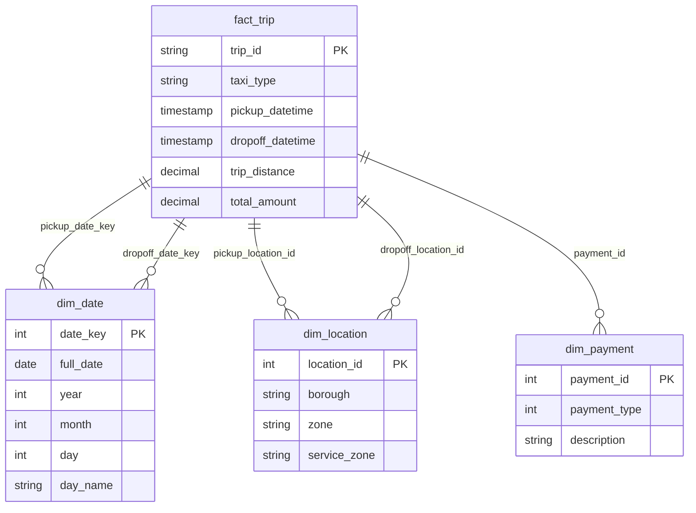

[](https://github.com/arturogonzalezm/nyc-taxi-etl/actions/workflows/ci.yml?query=branch%3Amain)
[](https://github.com/arturogonzalezm/nyc-taxi-etl/actions/workflows/ci.yml?query=branch%3Adevelop)
[](https://codecov.io/gh/arturogonzalezm/nyc-taxi-etl)
[](https://github.com/psf/black)
[](https://flake8.pycqa.org/)
[](https://pylint.pycqa.org/)

# NYC Taxi Data Pipeline

A production-ready PySpark ETL pipeline for processing NYC Taxi & Limousine Commission (TLC) trip data. The pipeline implements a medallion architecture (Bronze/Gold layers) with a dimensional model, supporting both local development (PostgreSQL) and cloud production (BigQuery) environments.

## Table of Contents

- [Architecture](#architecture)
- [Environments](#environments)
- [Infrastructure](#infrastructure)
- [Prerequisites](#prerequisites)
- [Quick Start](#quick-start)
- [Running the Pipeline](#running-the-pipeline)
- [Testing](#testing)
- [Documentation](#documentation)

### Additional Documentation

1. [Architecture Diagram](docs/1.ARCHITECTURE.md)
2. [Dataset Explanation](docs/2.DATASET.md)
3. [Data Model and Schema](docs/3.DATA_MODEL.md)
4. [Historical Strategy](docs/4.HISTORICAL_STRATEGY.md)
5. [Local Setup Guide](docs/5.LOCAL_SETUP.md)
6. [Terraform Infrastructure](docs/6.TERRAFORM.md)
7. [Limitations and Improvements](docs/7.LIMITATIONS_IMPROVEMENTS.md)
8. [Authentication Guide](docs/8.AUTHENTICATION.md)

## Architecture

The pipeline follows a medallion architecture with two deployment environments:



### Environment Comparison

| Aspect | Development | Production |
|--------|-------------|------------|
| **Orchestration** | Local Airflow (Docker) | Cloud Composer |
| **ETL Execution** | Local PySpark | Cloud Run |
| **Data Warehouse** | PostgreSQL | BigQuery |
| **Data Lake** | GCS | GCS |
| **Branch** | `develop/*` | `main` |

### Layer Overview

| Layer | Purpose | Storage |
|-------|---------|---------|
| Bronze | Raw data ingestion with metadata columns | GCS |
| Gold | Dimensional model with data quality checks | GCS |
| Load | Star schema for analytics | PostgreSQL (dev) / BigQuery (prod) |

## Environments

The project supports two environments with separate code paths:

```
environments/
├── dev/                              # Development environment
│   ├── dags/                         # Airflow DAGs
│   │   ├── taxi_ingestion_dag.py
│   │   ├── taxi_gold_dag.py
│   │   ├── postgres_load_dag.py
│   │   └── zone_lookup_ingestion_dag.py
│   ├── etl/jobs/                     # ETL jobs
│   │   ├── bronze/                   # Ingestion jobs
│   │   ├── gold/                     # Transformation jobs
│   │   ├── load/                     # PostgreSQL loader
│   │   └── utils/                    # Config, Spark manager
│   └── sql/postgres/                 # PostgreSQL DDL
│
└── prod/                             # Production environment
    ├── dags/                         # Airflow DAGs
    │   ├── taxi_ingestion_dag.py
    │   ├── taxi_gold_dag.py
    │   ├── bigquery_load_dag.py
    │   └── zone_lookup_ingestion_dag.py
    ├── etl/jobs/                     # ETL jobs
    │   ├── bronze/                   # Ingestion jobs
    │   ├── gold/                     # Transformation jobs
    │   ├── load/                     # BigQuery loader
    │   └── utils/                    # Config, Spark manager
    └── sql/bigquery/                 # BigQuery DDL
```

## Infrastructure

The project uses Terraform for GCP infrastructure provisioning:

```
terraform/
└── environments/
    ├── dev/                          # Development infrastructure
    │   ├── main.tf                   # GCP Project, APIs, Service Accounts
    │   ├── variables.tf              # Variable definitions
    │   ├── providers.tf              # Provider configuration
    │   ├── outputs.tf                # Output values
    │   └── config.tfvars             # Non-sensitive configuration
    │
    └── prod/                         # Production infrastructure
        ├── main.tf                   # Cloud Composer, Cloud Run, BigQuery
        ├── variables.tf              # Variable definitions
        ├── providers.tf              # Provider configuration
        ├── outputs.tf                # Output values
        └── config.tfvars             # Non-sensitive configuration
```

### Infrastructure by Environment

| Resource | Development | Production |
|----------|-------------|------------|
| **GCP Project** | ✓ | ✓ |
| **GCS Bucket** | ✓ | ✓ |
| **Service Accounts** | Pipeline SA, Airflow SA | Composer SA, Cloud Run SA, ETL SA |
| **Workload Identity** | ✓ | ✓ |
| **Cloud Composer** | - | ✓ |
| **Cloud Run** | - | ✓ |
| **BigQuery** | - | ✓ |
| **VPC + NAT** | - | ✓ |
| **Artifact Registry** | - | ✓ |

See [Terraform Infrastructure](docs/6.TERRAFORM.md) for detailed documentation.

### CI/CD Pipeline



| Stage | Trigger | Purpose |
|-------|---------|---------|
| 1-5 | All PRs/pushes | Linting, Terraform validate, security scan, tests |
| 6 | Push to `develop/*` | Deploy dev Terraform infrastructure |
| 7 | Push to `main` | Deploy prod infrastructure, build container, deploy DAGs |

---

## Prerequisites

- Python 3.12+
- Docker Desktop (for local development)
- Java 17+ (for PySpark)
- Google Cloud SDK
- Terraform 1.5.0

## Quick Start

### 1. Clone and Setup

```bash
git clone https://github.com/arturogonzalezm/nyc-taxi-etl
cd nyc-taxi-etl

# Create virtual environment
python -m venv .venv
source .venv/bin/activate  # On Windows: .venv\Scripts\activate

# Install dependencies
pip install ".[dev]"
```

### 2. Choose Your Environment

**For Development (local Docker + PostgreSQL):**

```bash
# Switch to develop branch
git checkout develop

# Set up GCP authentication
make setup

# Start all services
make up
```

**For Production (Cloud Composer + BigQuery):**

```bash
# Switch to main branch
git checkout main

# Deploy via CI/CD (push to main triggers deployment)
git push origin main
```

### 3. Access Services (Development)

| Service | URL | Credentials |
|---------|-----|-------------|
| Airflow UI | http://localhost:8080 | admin / admin |
| PostgreSQL | localhost:5432 | postgres / postgres |

### 4. Run the Pipeline

**Via Airflow UI:** Enable DAGs in the Airflow web interface.

**Via Command Line (Development):**

```bash
# Ingest taxi data
python -m environments.dev.etl.jobs.bronze.taxi_ingestion_job \
    --taxi-type yellow --year 2024 --month 1

# Transform to dimensional model
python -m environments.dev.etl.jobs.gold.taxi_gold_job \
    --taxi-type yellow --year 2024 --month 1

# Load to PostgreSQL
python -m environments.dev.etl.jobs.load.postgres_load_job \
    --taxi-type yellow --year 2024 --month 1
```

### 5. Query the Data

**Development (PostgreSQL):**

```bash
make postgres-shell

# Sample queries
SELECT COUNT(*) FROM taxi.fact_trip;
SELECT * FROM taxi.dim_location LIMIT 10;
```

**Production (BigQuery):**

```sql
-- In BigQuery Console
SELECT COUNT(*) FROM `project-id.taxi.fact_trip`;
SELECT * FROM `project-id.taxi.dim_location` LIMIT 10;
```

### 6. Stop Services

```bash
make down
```

## Running the Pipeline

### Bronze Layer (Ingestion)

Downloads raw parquet files from NYC TLC and stores them in GCS.

```bash
# Development
python -m environments.dev.etl.jobs.bronze.taxi_ingestion_job \
    --taxi-type yellow --year 2024 --month 1

# Bulk ingestion (date range)
python -m environments.dev.etl.jobs.bronze.taxi_ingestion_job \
    --taxi-type yellow \
    --start-year 2023 --start-month 1 \
    --end-year 2023 --end-month 12
```

### Zone Lookup (Reference Data)

```bash
python -m environments.dev.etl.jobs.misc.zone_lookup_ingestion_job
```

### Gold Layer (Transformation)

Transforms bronze data into a dimensional model.

```bash
python -m environments.dev.etl.jobs.gold.taxi_gold_job \
    --taxi-type yellow --year 2024 --month 1
```

### Load Layer

**Development (PostgreSQL):**

```bash
python -m environments.dev.etl.jobs.load.postgres_load_job \
    --taxi-type yellow --year 2024 --month 1
```

**Production (BigQuery):**

```bash
python -m environments.prod.etl.jobs.load.bigquery_load_job \
    --taxi-type yellow --year 2024 --month 1
```

## Makefile Commands

### General

| Command | Description |
|---------|-------------|
| `make init` | Initialize directories and create `.env` |
| `make up` | Start all services (PostgreSQL + Airflow) |
| `make down` | Stop all services |
| `make logs` | Show service logs |
| `make nuke` | Remove all containers, images, and volumes |
| `make setup` | Configure GCP authentication |

### PostgreSQL

| Command | Description |
|---------|-------------|
| `make postgres-start` | Start PostgreSQL container |
| `make postgres-stop` | Stop PostgreSQL container |
| `make postgres-shell` | Connect to PostgreSQL shell |
| `make postgres-status` | Show status and table counts |
| `make postgres-create-tables` | Create dimensional model tables |

## Data Model

### Star Schema

The gold layer produces a star schema:



See [Data Model Documentation](docs/3.DATA_MODEL.md) for full schema details.

## Testing

```bash
# Run all tests
pytest tests/ -v

# Run with coverage
pytest tests/ -v --cov=environments --cov-report=term

# Run specific test file
pytest tests/test_base_job.py -v
```

### Code Quality

```bash
# Format code
black environments/ tests/

# Lint
flake8 environments/ --max-line-length=100 --ignore=E501,W503
pylint environments/
```

## Environment Variables

### Storage Configuration

| Variable | Description |
|----------|-------------|
| `GCS_BUCKET` | GCS bucket name (auto-computed from config.tfvars) |
| `GCP_PROJECT_ID` | GCP project ID (auto-computed from config.tfvars) |

### Database Configuration (Development)

| Variable | Description |
|----------|-------------|
| `POSTGRES_HOST` | PostgreSQL host |
| `POSTGRES_PORT` | PostgreSQL port |
| `POSTGRES_DB` | PostgreSQL database |
| `POSTGRES_USER` | PostgreSQL user |
| `POSTGRES_PASSWORD` | PostgreSQL password |

> **Note:** Configuration is automatically loaded from `terraform/environments/{dev,prod}/config.tfvars`. See [Authentication Guide](docs/8.AUTHENTICATION.md) for GCP setup.

---

## License

This project is for demonstration purposes.
