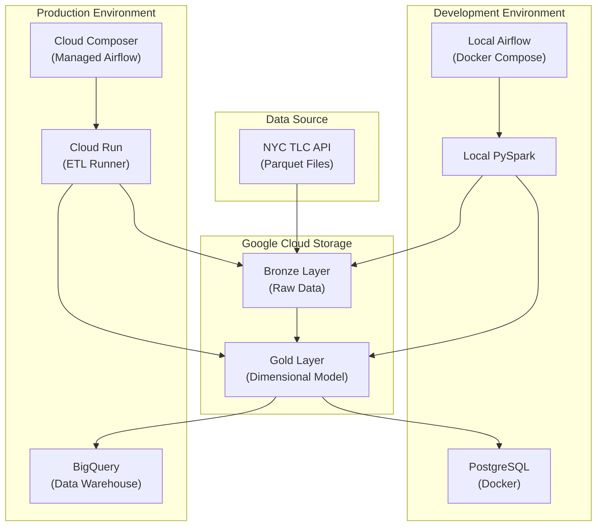
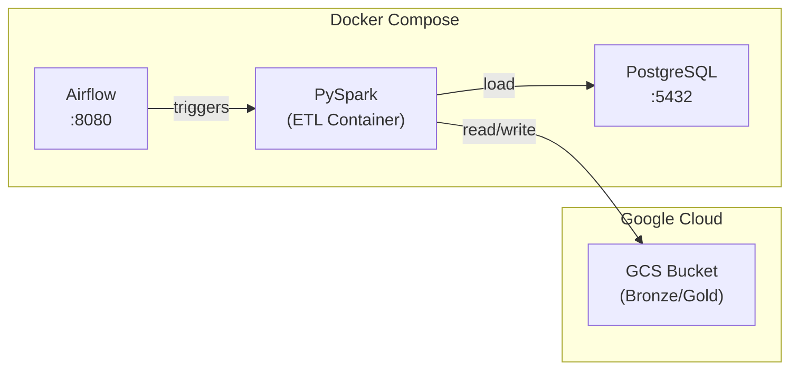
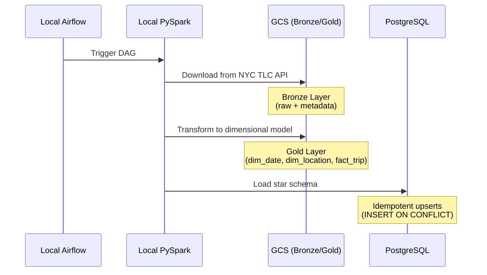
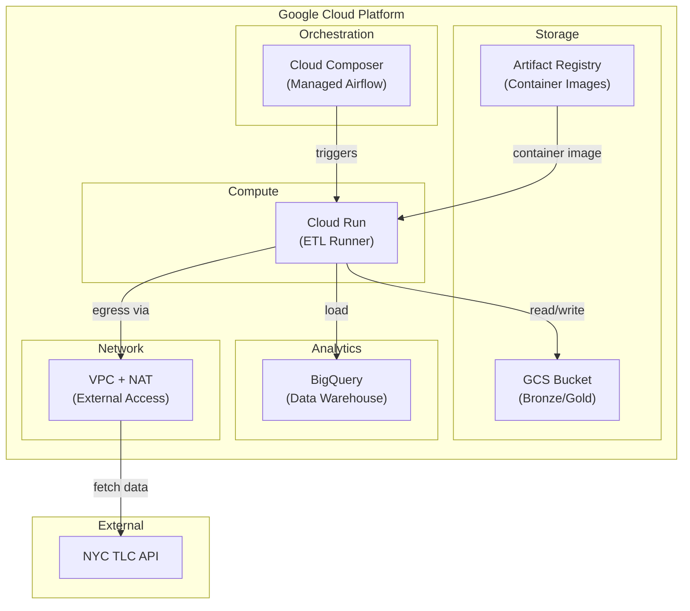
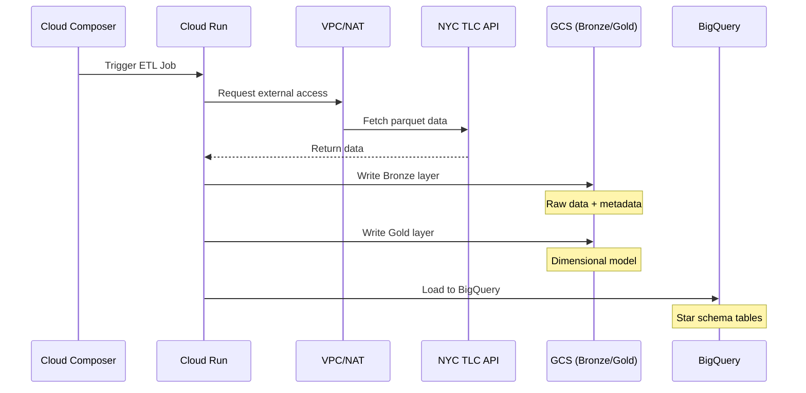
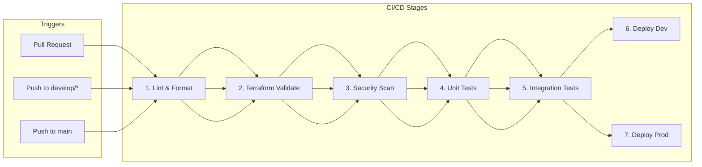

# Architecture

## Overview

The NYC Taxi Pipeline implements a **medallion architecture** with three layers: Bronze, Gold, and Load. The pipeline supports two deployment environments:

| Environment | Orchestration | ETL Execution | Data Warehouse | Use Case |
|-------------|---------------|---------------|----------------|----------|
| **Development** | Local Airflow (Docker) | Local PySpark | PostgreSQL | Local development & testing |
| **Production** | Cloud Composer | Cloud Run | BigQuery | Scalable cloud deployment |

Both environments share the same data lake (GCS) for Bronze and Gold layers.

## High-Level Architecture



## Development Environment Architecture

The development environment runs locally using Docker Compose, ideal for development and testing.



### Development Components

| Component | Technology | Purpose |
|-----------|------------|---------|
| **Orchestration** | Apache Airflow (Docker) | DAG scheduling and monitoring |
| **Processing** | PySpark 4.1.1 (Local) | Distributed data processing |
| **Data Lake** | Google Cloud Storage | Bronze/Gold layer storage |
| **Data Warehouse** | PostgreSQL 15 | Analytics database |
| **Authentication** | Service Account Impersonation | GCS access via ADC |

### Development Data Flow



## Production Environment Architecture

The production environment runs on Google Cloud Platform with fully managed services.



### Production Components

| Component | Technology | Purpose |
|-----------|------------|---------|
| **Orchestration** | Cloud Composer 2 | Managed Airflow for DAG scheduling |
| **Processing** | Cloud Run | Serverless ETL job execution |
| **Data Lake** | Google Cloud Storage | Bronze/Gold layer storage |
| **Data Warehouse** | BigQuery | Scalable analytics database |
| **Container Registry** | Artifact Registry | ETL container image storage |
| **Network** | VPC + Cloud NAT | External HTTPS access for data ingestion |

### Production Data Flow



## Medallion Architecture Layers

### Bronze Layer (Raw Ingestion)

| Aspect | Description |
|--------|-------------|
| **Purpose** | Ingest raw data with minimal transformation |
| **Storage** | Google Cloud Storage (GCS) |
| **Format** | Parquet with Snappy compression |
| **Metadata** | `record_hash`, `ingestion_timestamp`, `source_file` |
| **Partitioning** | By `taxi_type`, `year`, `month` |

### Gold Layer (Dimensional Model)

| Aspect | Description |
|--------|-------------|
| **Purpose** | Transform raw data into analytics-ready dimensional model |
| **Storage** | Google Cloud Storage (GCS) |
| **Format** | Parquet with Snappy compression |
| **Tables** | `dim_date`, `dim_location`, `dim_payment`, `fact_trip` |
| **Quality Checks** | Null validation, range checks, referential integrity |

### Load Layer (Data Warehouse)

| Aspect | Development | Production |
|--------|-------------|------------|
| **Purpose** | Serve data for analytics | Serve data for analytics |
| **Storage** | PostgreSQL | BigQuery |
| **Schema** | Star schema | Star schema |
| **Load Strategy** | Idempotent upserts | MERGE statements |

## CI/CD Pipeline



### CI/CD Workflow Summary

| Stage | Trigger | Actions |
|-------|---------|---------|
| **Stages 1-5** | All PRs and pushes | Lint, validate, test |
| **Stage 6** | Push to `develop/*` | Deploy dev Terraform infrastructure |
| **Stage 7** | Push to `main` | Deploy prod infrastructure, build container, deploy DAGs |

## Technology Stack Comparison

| Component | Development | Production |
|-----------|-------------|------------|
| **Orchestration** | Apache Airflow (Docker) | Cloud Composer 2 |
| **ETL Processing** | Local PySpark | Cloud Run |
| **Data Lake** | GCS | GCS |
| **Data Warehouse** | PostgreSQL 15 | BigQuery |
| **Authentication** | ADC + SA Impersonation | Workload Identity Federation |
| **Infrastructure** | Docker Compose | Terraform |
| **Container Registry** | Local | Artifact Registry |

## Directory Structure

```
nyc-taxi-etl/
├── environments/
│   ├── dev/                          # Development environment
│   │   ├── dags/                     # Airflow DAGs (PostgreSQL)
│   │   ├── etl/jobs/                 # ETL jobs (PySpark)
│   │   └── sql/postgres/             # PostgreSQL DDL
│   │
│   └── prod/                         # Production environment
│       ├── dags/                     # Airflow DAGs (BigQuery)
│       ├── etl/jobs/                 # ETL jobs (Cloud Run)
│       └── sql/bigquery/             # BigQuery DDL
│
├── terraform/
│   └── environments/
│       ├── dev/                      # Dev infrastructure
│       └── prod/                     # Prod infrastructure
│
├── tests/                            # Unit tests
├── docs/                             # Documentation
└── docker-compose.yml                # Local development services
```

## Related Documentation

- [Data Model and Schema](3.DATA_MODEL.md) - Star schema design
- [Terraform Infrastructure](6.TERRAFORM.md) - Infrastructure as code
- [Local Setup Guide](5.LOCAL_SETUP.md) - Running locally with Docker
- [Authentication Guide](8.AUTHENTICATION.md) - GCP authentication setup
