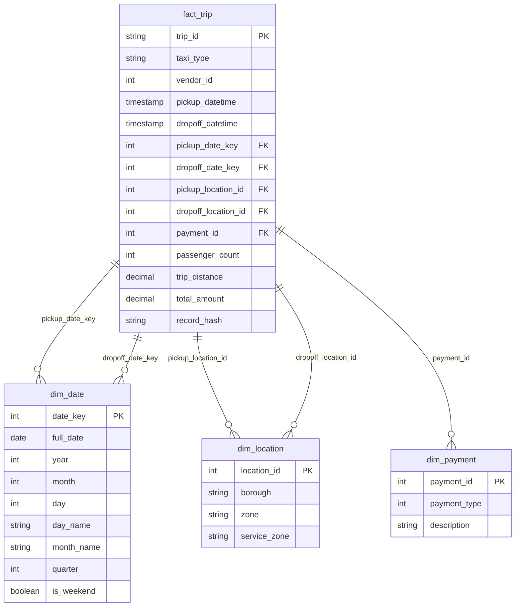

# Data Model and Schema

## Overview

The pipeline implements a **Kimball-style star schema** dimensional model optimized for analytical queries. The same logical model is deployed to both environments:

| Environment | Data Warehouse | Load Strategy |
|-------------|----------------|---------------|
| Development | PostgreSQL | `INSERT ON CONFLICT` (upsert) |
| Production | BigQuery | `MERGE` statements |



### Kimball Methodology

Key Kimball principles applied in this model:

| Principle | Implementation |
|-----------|----------------|
| **Star Schema** | Central fact table surrounded by dimension tables |
| **Conformed Dimensions** | Reusable dimensions (date, location) shared across fact tables |
| **Surrogate Keys** | Integer-based keys for dimensions (`date_key`, `location_id`) |
| **Denormalized Dimensions** | Dimensions contain descriptive attributes for easy querying |
| **SCD Type 1** | Dimensions use overwrite strategy |
| **Grain** | One row per taxi trip in the fact table |

## Dimension Tables

### dim_date

Date dimension for time-based analysis.

| Column | Type | Description |
|--------|------|-------------|
| `date_key` | INTEGER | Primary key (YYYYMMDD format) |
| `full_date` | DATE | Full date value |
| `year` | INTEGER | Year (e.g., 2024) |
| `month` | INTEGER | Month (1-12) |
| `day` | INTEGER | Day of month (1-31) |
| `day_of_week` | INTEGER | Day of week (1=Monday, 7=Sunday) |
| `day_name` | VARCHAR(10) | Day name (Monday, Tuesday, etc.) |
| `month_name` | VARCHAR(10) | Month name (January, February, etc.) |
| `quarter` | INTEGER | Quarter (1-4) |
| `is_weekend` | BOOLEAN | Weekend flag |

### dim_location

Location dimension based on NYC taxi zones.

| Column | Type | Description |
|--------|------|-------------|
| `location_id` | INTEGER | Primary key (1-265) |
| `borough` | VARCHAR(50) | NYC borough name |
| `zone` | VARCHAR(100) | Zone/neighborhood name |
| `service_zone` | VARCHAR(50) | Service zone category |

### dim_payment

Payment type dimension.

| Column | Type | Description |
|--------|------|-------------|
| `payment_id` | INTEGER | Primary key |
| `payment_type` | INTEGER | Payment type code |
| `description` | VARCHAR(50) | Payment description |

**Payment Types:**

| Code | Description |
|------|-------------|
| 1 | Credit Card |
| 2 | Cash |
| 3 | No Charge |
| 4 | Dispute |
| 5 | Unknown |
| 6 | Voided Trip |

## Fact Table

### fact_trip

Central fact table containing trip metrics.

| Column | Type | Description |
|--------|------|-------------|
| `trip_id` | VARCHAR(64) | Primary key (hash-based) |
| `taxi_type` | VARCHAR(10) | Taxi type (yellow/green) |
| `vendor_id` | INTEGER | Vendor identifier |
| `pickup_datetime` | TIMESTAMP | Pickup timestamp |
| `dropoff_datetime` | TIMESTAMP | Dropoff timestamp |
| `pickup_date_key` | INTEGER | FK to dim_date |
| `dropoff_date_key` | INTEGER | FK to dim_date |
| `pickup_location_id` | INTEGER | FK to dim_location |
| `dropoff_location_id` | INTEGER | FK to dim_location |
| `payment_id` | INTEGER | FK to dim_payment |
| `passenger_count` | INTEGER | Number of passengers |
| `trip_distance` | DECIMAL(10,2) | Distance in miles |
| `rate_code_id` | INTEGER | Rate code |
| `fare_amount` | DECIMAL(10,2) | Base fare |
| `extra` | DECIMAL(10,2) | Extra charges |
| `mta_tax` | DECIMAL(10,2) | MTA tax |
| `tip_amount` | DECIMAL(10,2) | Tip amount |
| `tolls_amount` | DECIMAL(10,2) | Toll charges |
| `improvement_surcharge` | DECIMAL(10,2) | Improvement surcharge |
| `congestion_surcharge` | DECIMAL(10,2) | Congestion surcharge |
| `airport_fee` | DECIMAL(10,2) | Airport fee |
| `total_amount` | DECIMAL(10,2) | Total trip cost |
| `record_hash` | VARCHAR(64) | Unique record hash |
| `ingestion_timestamp` | TIMESTAMP | When record was ingested |

## Indexes

### PostgreSQL (Development)

```sql
-- Primary Keys
ALTER TABLE taxi.dim_date ADD PRIMARY KEY (date_key);
ALTER TABLE taxi.dim_location ADD PRIMARY KEY (location_id);
ALTER TABLE taxi.dim_payment ADD PRIMARY KEY (payment_id);
ALTER TABLE taxi.fact_trip ADD PRIMARY KEY (trip_id);

-- Foreign Key Indexes
CREATE INDEX idx_fact_trip_pickup_date ON taxi.fact_trip(pickup_date_key);
CREATE INDEX idx_fact_trip_dropoff_date ON taxi.fact_trip(dropoff_date_key);
CREATE INDEX idx_fact_trip_pickup_location ON taxi.fact_trip(pickup_location_id);
CREATE INDEX idx_fact_trip_dropoff_location ON taxi.fact_trip(dropoff_location_id);
CREATE INDEX idx_fact_trip_payment ON taxi.fact_trip(payment_id);
CREATE INDEX idx_fact_trip_taxi_type ON taxi.fact_trip(taxi_type);
```

### BigQuery (Production)

BigQuery uses clustering instead of traditional indexes:

```sql
-- Clustered tables for query optimization
CREATE TABLE taxi.fact_trip
CLUSTER BY pickup_date_key, taxi_type, pickup_location_id
AS SELECT * FROM ...
```

## Load Strategies

### PostgreSQL (Development)

Uses idempotent upserts with `INSERT ON CONFLICT`:

```sql
INSERT INTO taxi.fact_trip (trip_id, taxi_type, ...)
VALUES ($1, $2, ...)
ON CONFLICT (trip_id) DO UPDATE SET
    taxi_type = EXCLUDED.taxi_type,
    ...
```

### BigQuery (Production)

Uses `MERGE` statements for idempotent loading:

```sql
MERGE taxi.fact_trip AS target
USING staging_table AS source
ON target.trip_id = source.trip_id
WHEN MATCHED THEN UPDATE SET ...
WHEN NOT MATCHED THEN INSERT ...
```

## Sample Queries

### Trips by Borough

**PostgreSQL:**
```sql
SELECT 
    l.borough,
    COUNT(*) as trip_count,
    AVG(f.total_amount) as avg_fare
FROM taxi.fact_trip f
JOIN taxi.dim_location l ON f.pickup_location_id = l.location_id
GROUP BY l.borough
ORDER BY trip_count DESC;
```

**BigQuery:**
```sql
SELECT 
    l.borough,
    COUNT(*) as trip_count,
    AVG(f.total_amount) as avg_fare
FROM `project-id.taxi.fact_trip` f
JOIN `project-id.taxi.dim_location` l ON f.pickup_location_id = l.location_id
GROUP BY l.borough
ORDER BY trip_count DESC;
```

### Daily Revenue

**PostgreSQL:**
```sql
SELECT 
    d.full_date,
    d.day_name,
    SUM(f.total_amount) as daily_revenue,
    COUNT(*) as trip_count
FROM taxi.fact_trip f
JOIN taxi.dim_date d ON f.pickup_date_key = d.date_key
GROUP BY d.full_date, d.day_name
ORDER BY d.full_date;
```

**BigQuery:**
```sql
SELECT 
    d.full_date,
    d.day_name,
    SUM(f.total_amount) as daily_revenue,
    COUNT(*) as trip_count
FROM `project-id.taxi.fact_trip` f
JOIN `project-id.taxi.dim_date` d ON f.pickup_date_key = d.date_key
GROUP BY d.full_date, d.day_name
ORDER BY d.full_date;
```

### Payment Method Analysis

```sql
SELECT 
    p.description as payment_method,
    COUNT(*) as trip_count,
    SUM(f.total_amount) as total_revenue,
    AVG(f.tip_amount) as avg_tip
FROM taxi.fact_trip f
JOIN taxi.dim_payment p ON f.payment_id = p.payment_id
GROUP BY p.description
ORDER BY trip_count DESC;
```

### Weekend vs Weekday Comparison

```sql
SELECT 
    CASE WHEN d.is_weekend THEN 'Weekend' ELSE 'Weekday' END as day_type,
    COUNT(*) as trip_count,
    AVG(f.total_amount) as avg_fare,
    AVG(f.trip_distance) as avg_distance
FROM taxi.fact_trip f
JOIN taxi.dim_date d ON f.pickup_date_key = d.date_key
GROUP BY d.is_weekend;
```

## Schema Files

| Environment | Location |
|-------------|----------|
| Development (PostgreSQL) | `environments/dev/sql/postgres/create_dimensional_model.sql` |
| Production (BigQuery) | `environments/prod/sql/bigquery/create_dimensional_model.sql` |

## Related Documentation

- [Architecture](1.ARCHITECTURE.md) - System architecture overview
- [Historical Strategy](4.HISTORICAL_STRATEGY.md) - SCD and backfill strategies
- [Dataset](2.DATASET.md) - NYC TLC data source details
