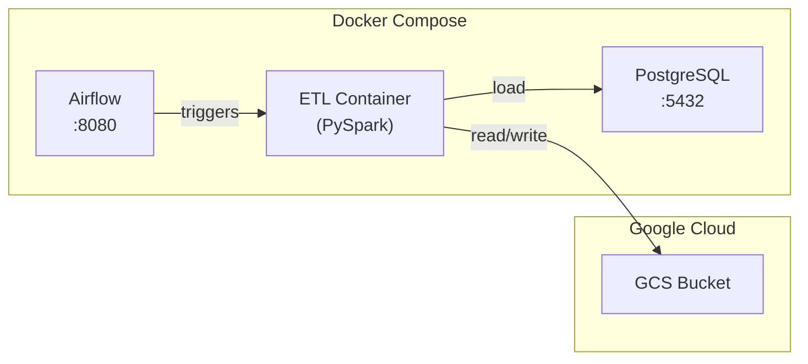
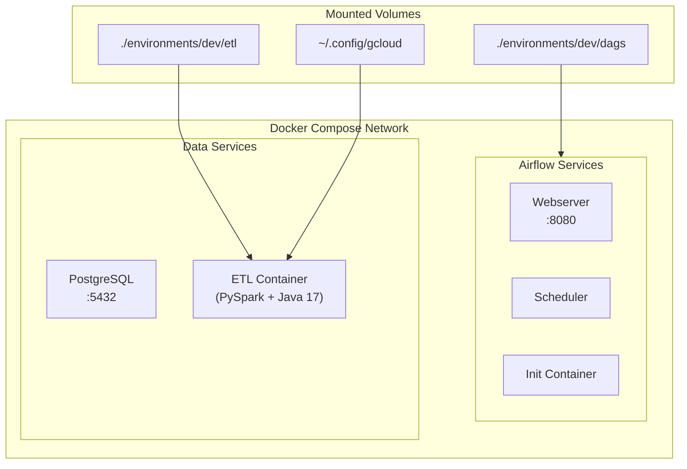

# Local Development Setup

## Overview

This guide explains how to run the NYC Taxi ETL pipeline locally using Docker Compose. The local development environment uses:

- **Apache Airflow** for orchestration
- **PostgreSQL** as the data warehouse
- **PySpark** for ETL processing
- **Google Cloud Storage** for the data lake (Bronze/Gold layers)



## Prerequisites

| Requirement | Version | Purpose |
|-------------|---------|---------|
| Docker Desktop | Latest | Container runtime |
| Docker Compose | v2.0+ | Multi-container orchestration |
| Python | 3.12+ | Local development |
| Java | 17+ | PySpark runtime |
| Make | Any | Task automation |
| Google Cloud SDK | Latest | GCS authentication |

## Quick Start

### 1. Clone the Repository

```bash
git clone https://github.com/arturogonzalezm/nyc-taxi-etl
cd nyc-taxi-etl

# Switch to develop branch for local development
git checkout develop
```

### 2. Install Python Dependencies

```bash
python -m venv .venv
source .venv/bin/activate  # On Windows: .venv\Scripts\activate
pip install ".[dev]"
```

### 3. Configure GCP Authentication

```bash
# Set up GCP credentials and grant bucket access
make setup
```

This command:
- Generates Application Default Credentials (ADC)
- Grants your account access to the GCS bucket

### 4. Start All Services

```bash
make up
```

This command:
- Creates `.env` file from template (if not exists)
- Starts PostgreSQL (data warehouse)
- Starts ETL container (PySpark)
- Starts Airflow services (Webserver, Scheduler)
- Displays service URLs and credentials

### 5. Access Services

| Service | URL | Credentials |
|---------|-----|-------------|
| Airflow UI | http://localhost:8080 | admin / admin |
| PostgreSQL | localhost:5432 | postgres / postgres |

## Docker Services Architecture



### Service Details

| Service | Container Name | Ports | Purpose |
|---------|---------------|-------|---------|
| PostgreSQL | nyc-taxi-etl-postgres | 5432 | Data warehouse |
| ETL | nyc-taxi-etl-etl | - | PySpark processing |
| Airflow Webserver | nyc-taxi-etl-airflow-webserver | 8080 | Airflow UI |
| Airflow Scheduler | nyc-taxi-etl-airflow-scheduler | - | DAG scheduling |

## Running ETL Jobs

### Option 1: Via Airflow UI

1. Open http://localhost:8080
2. Login with admin/admin
3. Enable the desired DAG:
   - `taxi_ingestion_dag` - Bronze layer ingestion
   - `taxi_gold_dag` - Gold layer transformation
   - `postgres_load_dag` - PostgreSQL loading
   - `zone_lookup_ingestion_dag` - Reference data

### Option 2: Via Command Line (Host)

Run jobs directly from your local machine:

```bash
# Activate virtual environment
source .venv/bin/activate

# Ingest taxi data
python -m environments.dev.etl.jobs.bronze.taxi_ingestion_job \
    --taxi-type yellow --year 2024 --month 1

# Transform to dimensional model
python -m environments.dev.etl.jobs.gold.taxi_gold_job \
    --taxi-type yellow --year 2024 --month 1

# Load to PostgreSQL
python -m environments.dev.etl.jobs.load.postgres_load_job \
    --taxi-type yellow --year 2024 --month 1
```

### Option 3: Via Docker Container

```bash
# Enter the ETL container
docker exec -it nyc-taxi-etl-etl bash

# Run jobs inside container
python -m environments.dev.etl.jobs.bronze.taxi_ingestion_job \
    --taxi-type yellow --year 2024 --month 1
```

## Complete ETL Commands Reference

### Bronze Layer - Data Ingestion

#### Taxi Trip Data

```bash
# Single month (yellow taxi)
python -m environments.dev.etl.jobs.bronze.taxi_ingestion_job \
    --taxi-type yellow --year 2024 --month 1

# Single month (green taxi)
python -m environments.dev.etl.jobs.bronze.taxi_ingestion_job \
    --taxi-type green --year 2024 --month 1

# Bulk ingestion (date range)
python -m environments.dev.etl.jobs.bronze.taxi_ingestion_job \
    --taxi-type yellow \
    --start-year 2023 --start-month 1 \
    --end-year 2023 --end-month 12

# Show help
python -m environments.dev.etl.jobs.bronze.taxi_ingestion_job --help
```

#### Zone Lookup (Reference Data)

```bash
# Ingest taxi zone lookup (required for dim_location)
python -m environments.dev.etl.jobs.misc.zone_lookup_ingestion_job
```

#### Safe Backfill (Re-processing Historical Data)

```bash
# Backfill specific months
python environments/dev/etl/jobs/bronze/taxi_injection_safe_backfill_job.py \
    yellow 2023-03 2023-07

# Backfill a date range
python environments/dev/etl/jobs/bronze/taxi_injection_safe_backfill_job.py \
    yellow 2023-01:2023-12

# Backfill without deleting existing data
python environments/dev/etl/jobs/bronze/taxi_injection_safe_backfill_job.py \
    yellow 2024-01 --no-delete
```

### Gold Layer - Transformation

```bash
# Transform single month
python -m environments.dev.etl.jobs.gold.taxi_gold_job \
    --taxi-type yellow --year 2024 --month 1

# Transform date range
python -m environments.dev.etl.jobs.gold.taxi_gold_job \
    --taxi-type yellow \
    --year 2023 --month 1 \
    --end-year 2023 --end-month 6

# Show help
python -m environments.dev.etl.jobs.gold.taxi_gold_job --help
```

### Load Layer - PostgreSQL

```bash
# Load all data for a taxi type
python -m environments.dev.etl.jobs.load.postgres_load_job --taxi-type yellow

# Load specific month
python -m environments.dev.etl.jobs.load.postgres_load_job \
    --taxi-type yellow --year 2024 --month 1

# Show help
python -m environments.dev.etl.jobs.load.postgres_load_job --help
```

### Full Pipeline Example

Run the complete pipeline for January 2024 yellow taxi data:

```bash
# Step 1: Ingest zone lookup (one-time setup)
python -m environments.dev.etl.jobs.misc.zone_lookup_ingestion_job

# Step 2: Ingest taxi trip data
python -m environments.dev.etl.jobs.bronze.taxi_ingestion_job \
    --taxi-type yellow --year 2024 --month 1

# Step 3: Transform to dimensional model
python -m environments.dev.etl.jobs.gold.taxi_gold_job \
    --taxi-type yellow --year 2024 --month 1

# Step 4: Load to PostgreSQL
python -m environments.dev.etl.jobs.load.postgres_load_job \
    --taxi-type yellow --year 2024 --month 1
```

## Makefile Commands

### General Commands

| Command | Description |
|---------|-------------|
| `make init` | Initialize project (create .env, directories) |
| `make check` | Run pre-flight checks (Docker, .env, GCP creds) |
| `make setup` | Configure GCP authentication |
| `make up` | Start all services |
| `make down` | Stop all services |
| `make logs` | Show service logs |
| `make nuke` | Remove all containers, images, volumes |

### PostgreSQL Commands

| Command | Description |
|---------|-------------|
| `make postgres-start` | Start PostgreSQL only |
| `make postgres-stop` | Stop PostgreSQL |
| `make postgres-shell` | Connect to psql shell |
| `make postgres-status` | Show status and table counts |
| `make postgres-create-tables` | Create dimensional model tables |
| `make postgres-nuke` | Destroy and recreate PostgreSQL |

## Environment Variables

The `.env` file is auto-generated from `.env.example`:

```bash
# Project Configuration
PROJECT_ID_BASE=nyc-taxi-etl
ENVIRONMENT=dev

# GCP Configuration (auto-computed from terraform/environments/dev/config.tfvars)
GCP_PROJECT_ID=nyc-taxi-etl-dev-003
GCS_BUCKET=nyc-taxi-etl-dev-gcs-us-central1-003

# PostgreSQL Configuration
POSTGRES_USER=postgres
POSTGRES_PASSWORD=postgres
POSTGRES_DB=nyc_taxi
POSTGRES_HOST=localhost
POSTGRES_PORT=5432

# Airflow Configuration
AIRFLOW_ADMIN_USERNAME=admin
AIRFLOW_ADMIN_PASSWORD=admin
```

## Querying Data

### PostgreSQL

```bash
# Using make command
make postgres-shell

# Or directly with psql
psql -h localhost -p 5432 -U postgres -d nyc_taxi
```

Sample queries:

```sql
-- Count trips
SELECT COUNT(*) FROM taxi.fact_trip;

-- Trips by borough
SELECT 
    l.borough,
    COUNT(*) as trip_count,
    AVG(f.total_amount) as avg_fare
FROM taxi.fact_trip f
JOIN taxi.dim_location l ON f.pickup_location_id = l.location_id
GROUP BY l.borough
ORDER BY trip_count DESC;

-- Daily revenue
SELECT 
    d.full_date,
    SUM(f.total_amount) as daily_revenue
FROM taxi.fact_trip f
JOIN taxi.dim_date d ON f.pickup_date_key = d.date_key
GROUP BY d.full_date
ORDER BY d.full_date;
```

## Troubleshooting

### Services Won't Start

```bash
# Check Docker is running
docker info

# Check for port conflicts
lsof -i :8080
lsof -i :5432

# View detailed logs
docker-compose logs -f
```

### GCP Authentication Issues

```bash
# Re-authenticate
gcloud auth application-default login

# Verify credentials exist
ls -la ~/.config/gcloud/application_default_credentials.json

# Re-run setup
make setup
```

### Clean Restart

```bash
# Stop and remove everything
make nuke

# Start fresh
make up
```

### ETL Container Exits

```bash
# Check logs
docker logs nyc-taxi-etl-etl

# Rebuild container
docker-compose build etl
docker-compose up -d etl
```

## Development Workflow

### Live Code Updates

The `./environments/dev/etl` folder is mounted as a volume, so code changes are reflected immediately:

```bash
# Edit code locally
vim environments/dev/etl/jobs/bronze/taxi_ingestion_job.py

# Run updated code
python -m environments.dev.etl.jobs.bronze.taxi_ingestion_job --help
```

### Running Tests

```bash
# Run all tests
pytest tests/ -v

# Run with coverage
pytest tests/ -v --cov=environments --cov-report=html

# Run specific test
pytest tests/test_taxi_ingestion_job.py -v
```

### Code Quality

```bash
# Format code
black environments/ tests/

# Lint
flake8 environments/ --max-line-length=100 --ignore=E501,W503
```

## Stopping Services

```bash
# Stop services (keep data)
make down

# Stop and remove all data
make nuke
```

## Related Documentation

- [Architecture](1.ARCHITECTURE.md) - System architecture overview
- [Data Model](3.DATA_MODEL.md) - Star schema design
- [Authentication](8.AUTHENTICATION.md) - GCP authentication setup
- [Terraform](6.TERRAFORM.md) - Infrastructure configuration
