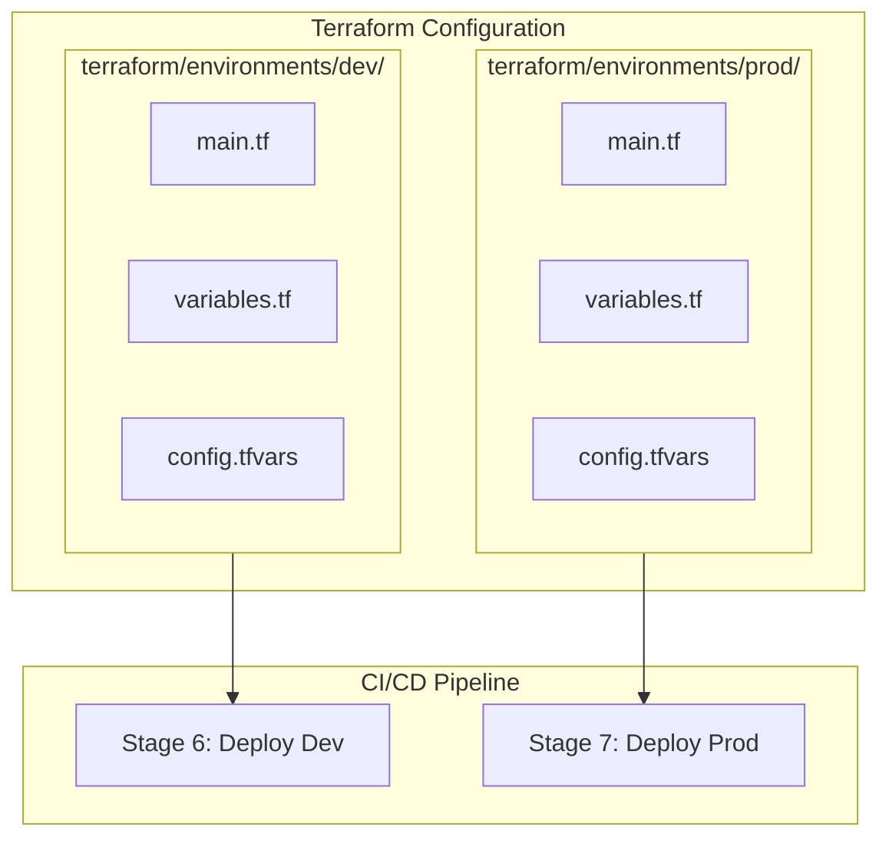
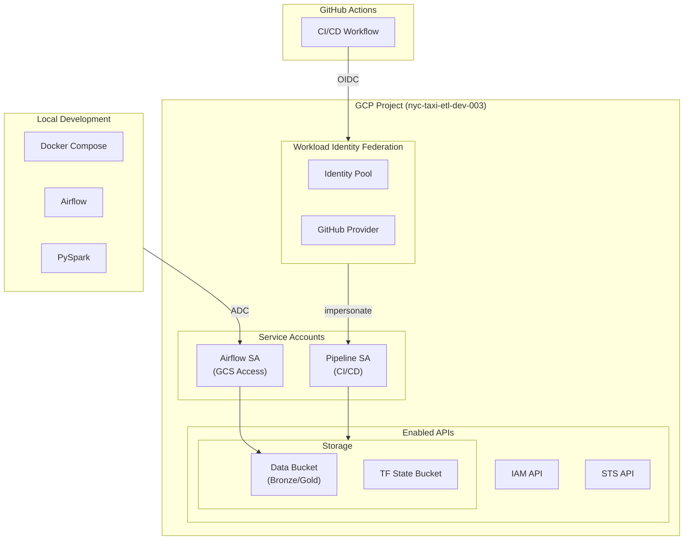
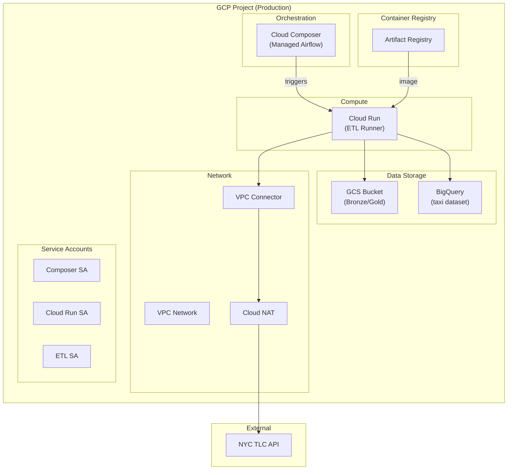
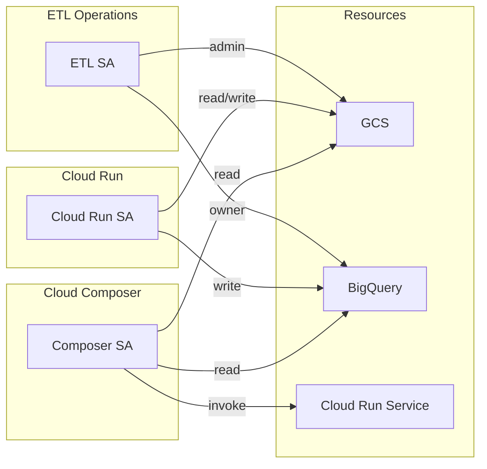
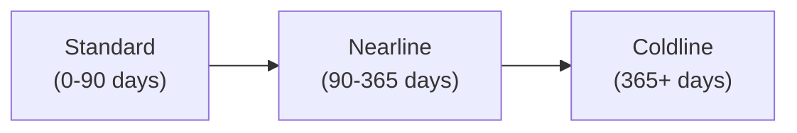
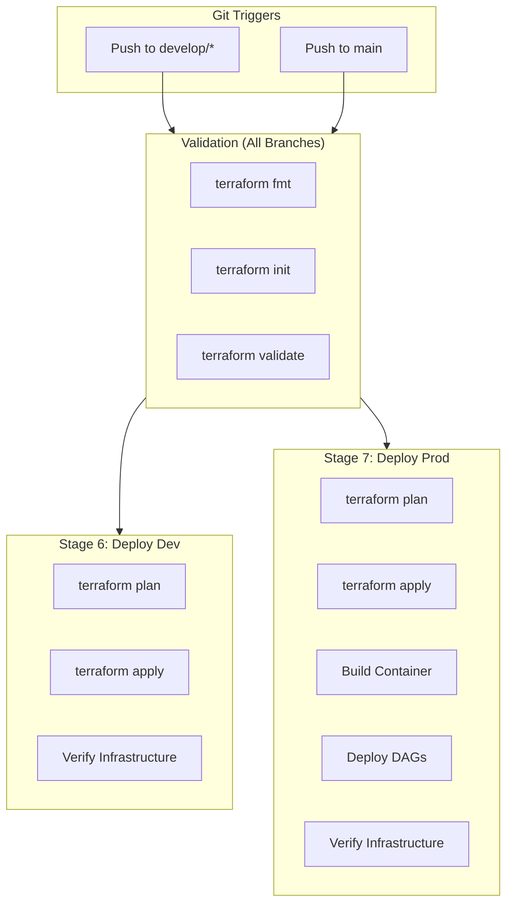
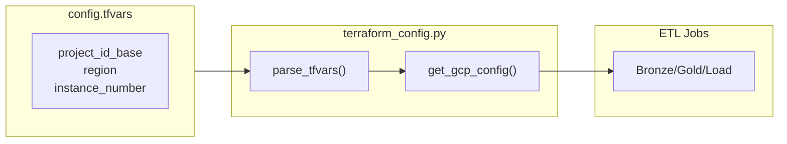

# Terraform Infrastructure

## Overview

The NYC Taxi ETL pipeline uses Terraform to manage Google Cloud Platform (GCP) infrastructure. The configuration is organized into **environment-specific modules** under `terraform/environments/`.



## Directory Structure

```
terraform/
└── environments/
    ├── dev/                    # Development environment
    │   ├── main.tf             # Resource definitions
    │   ├── variables.tf        # Variable declarations & locals
    │   ├── providers.tf        # Provider configuration
    │   ├── outputs.tf          # Output values
    │   ├── config.tfvars       # Non-sensitive configuration
    │   └── terraform.tfvars.example
    │
    └── prod/                   # Production environment
        ├── main.tf             # Resource definitions
        ├── variables.tf        # Variable declarations & locals
        ├── providers.tf        # Provider configuration
        ├── outputs.tf          # Output values
        ├── config.tfvars       # Non-sensitive configuration
        └── terraform.tfvars.example
```

## Environment Comparison

| Aspect | Development | Production |
|--------|-------------|------------|
| **Purpose** | Local development with docker-compose | Cloud-native production deployment |
| **Orchestration** | Local Airflow (docker-compose) | Cloud Composer (managed Airflow) |
| **ETL Execution** | Local PySpark | Cloud Run |
| **Data Warehouse** | PostgreSQL (local) | BigQuery |
| **Storage** | GCS | GCS |
| **Authentication** | Workload Identity Federation | Workload Identity Federation |

## Development Environment

The development environment (`terraform/environments/dev/`) creates foundational GCP resources for local development.

### Architecture



### Resources Created

| Resource | Description |
|----------|-------------|
| **GCP Project** | Creates project within organization |
| **APIs** | Enables required GCP APIs (IAM, Storage, STS, etc.) |
| **Service Accounts** | Pipeline SA + Airflow SA (GCS-only access) |
| **Workload Identity Federation** | GitHub Actions OIDC authentication |
| **GCS Buckets** | Data bucket + Terraform state bucket |
| **IAM Roles** | Project-level permissions for service accounts |

### Naming Convention

Resources follow the pattern: `{project_id_base}-{environment}-{resource_type}-{region}-{instance_number}`

| Resource | Example |
|----------|---------|
| Project ID | `nyc-taxi-etl-dev-003` |
| GCS Bucket | `nyc-taxi-etl-dev-gcs-us-central1-003` |
| Service Account | `nyc-taxi-etl-dev-sa-003@nyc-taxi-etl-dev-003.iam.gserviceaccount.com` |

## Production Environment

The production environment (`terraform/environments/prod/`) creates cloud-native infrastructure for running the ETL pipeline at scale.

### Architecture



### Resources Created

| Resource | Description |
|----------|-------------|
| **Cloud Composer** | Managed Apache Airflow for DAG orchestration |
| **Cloud Run** | Serverless ETL job execution |
| **BigQuery** | Data warehouse with `taxi` dataset |
| **VPC Network** | Network for Cloud Run egress (NAT for external access) |
| **Artifact Registry** | Container image storage |
| **Service Accounts** | Composer SA, Cloud Run SA, ETL SA |
| **GCS Bucket** | Production data storage with lifecycle policies |

### Service Accounts



| Service Account | Purpose | Key Permissions |
|-----------------|---------|-----------------|
| **Composer SA** | Cloud Composer operations | Composer Worker, GCS Admin, Cloud Run Invoker |
| **Cloud Run SA** | ETL job execution | GCS Admin, BigQuery Editor/Job User |
| **ETL SA** | Data operations | GCS Admin, BigQuery Data Owner |

### GCS Lifecycle Policies

Production bucket includes automatic storage class transitions:



| Age | Storage Class | Cost |
|-----|---------------|------|
| 0-90 days | Standard | Highest |
| 90-365 days | Nearline | Medium |
| 365+ days | Coldline | Lowest |

## Configuration Files

### `config.tfvars` (Non-Sensitive)

Each environment has a `config.tfvars` file containing non-sensitive configuration:

**Development (`terraform/environments/dev/config.tfvars`):**
```hcl
project_id_base = "nyc-taxi-etl"
project_name    = "NYC Taxi Pipeline"
instance_number = "003"
resource_type   = "gcs"
region          = "us-central1"
zone            = "us-central1-a"
environment     = "dev"
```

**Production (`terraform/environments/prod/config.tfvars`):**
```hcl
project_id_base        = "nyc-taxi-etl"
instance_number        = "003"
resource_type          = "gcs"
region                 = "us-central1"
zone                   = "us-central1-a"
environment            = "prod"
composer_image_version = "composer-2.9.7-airflow-2.9.3"
```

### Sensitive Variables (GitHub Secrets)

Sensitive values are stored in GitHub Secrets and passed during CI/CD:

| Secret | Description | Used By |
|--------|-------------|---------|
| `GCP_BILLING_ACCOUNT_ID` | GCP billing account ID | Dev |
| `GCP_ORGANISATION_ID` | GCP organization ID | Dev |
| `GCP_WORKLOAD_IDENTITY_PROVIDER` | WIF provider (dev) | Dev |
| `GCP_SERVICE_ACCOUNT` | Service account email (dev) | Dev |
| `GCP_WORKLOAD_IDENTITY_PROVIDER_PROD` | WIF provider (prod) | Prod |
| `GCP_SERVICE_ACCOUNT_PROD` | Service account email (prod) | Prod |

## CI/CD Integration



### Development Deployment (Stage 6)

Triggered on push to `develop` or `develop/*` branches:

```yaml
deploy-dev:
  if: github.event_name == 'push' && (github.ref == 'refs/heads/develop' || startsWith(github.ref, 'refs/heads/develop/'))
  working-directory: ./terraform/environments/dev
```

### Production Deployment (Stage 7)

Triggered on push to `main` branch:

```yaml
deploy-prod:
  if: github.event_name == 'push' && github.ref == 'refs/heads/main'
  working-directory: ./terraform/environments/prod
```

Production deployment includes additional steps:
1. Terraform apply
2. Build and push ETL container to Artifact Registry
3. Update Cloud Run service
4. Deploy DAGs to Cloud Composer

## Usage

### Local Terraform Commands

**Development environment:**
```bash
cd terraform/environments/dev
terraform init
terraform plan \
  -var-file=config.tfvars \
  -var="billing_account_id=XXX" \
  -var="organisation_id=XXX" \
  -var="github_repository=owner/repo"
terraform apply \
  -var-file=config.tfvars \
  -var="billing_account_id=XXX" \
  -var="organisation_id=XXX" \
  -var="github_repository=owner/repo"
```

**Production environment:**
```bash
cd terraform/environments/prod
terraform init
terraform plan \
  -var="project_id=nyc-taxi-etl-prod-us-central1-003" \
  -var="region=us-central1"
terraform apply \
  -var="project_id=nyc-taxi-etl-prod-us-central1-003" \
  -var="region=us-central1"
```

### Validation

```bash
# Format check
terraform fmt -check

# Validate configuration
terraform init -backend=false
terraform validate
```

## Code Integration

The ETL code reads configuration from `config.tfvars` files:



```python
# environments/dev/etl/jobs/utils/terraform_config.py
from environments.dev.etl.jobs.utils.terraform_config import get_gcp_config

project_id, bucket_name = get_gcp_config()
# Returns: ('nyc-taxi-etl-dev-us-central1-003', 'nyc-taxi-etl-dev-gcs-us-central1-003')
```

This allows the ETL jobs to automatically derive GCP configuration from Terraform variables, ensuring consistency between infrastructure and application code.

## Related Documentation

- [Architecture](1.ARCHITECTURE.md) - System architecture overview
- [Local Setup](5.LOCAL_SETUP.md) - Running locally with Docker
- [Authentication](8.AUTHENTICATION.md) - GCP authentication setup
