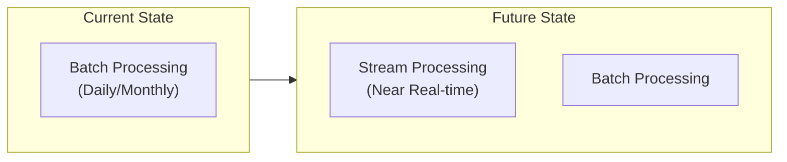
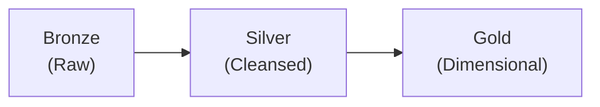
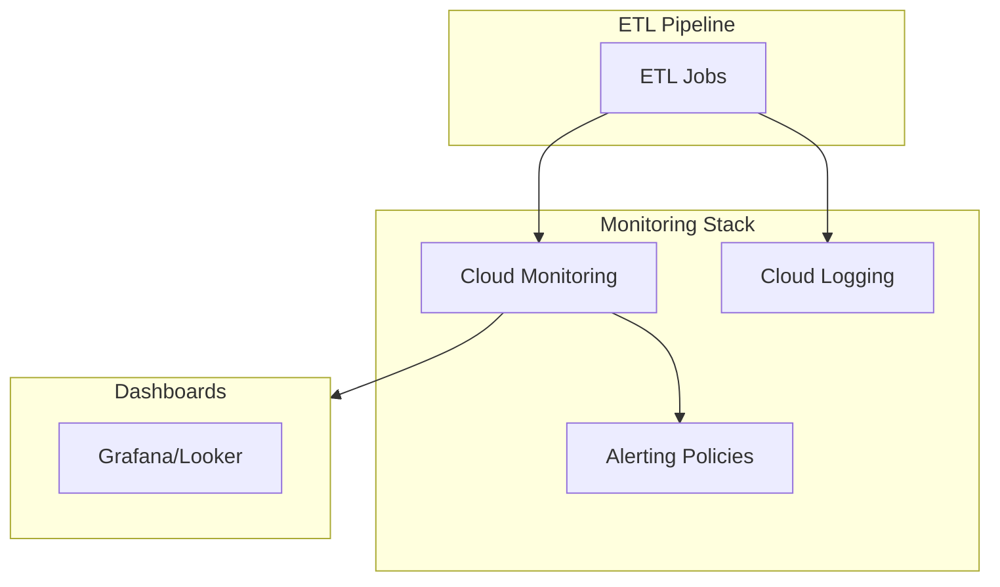
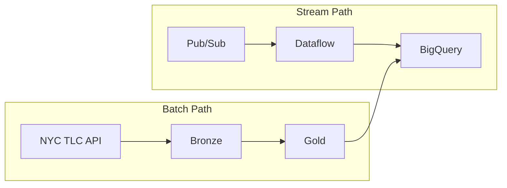
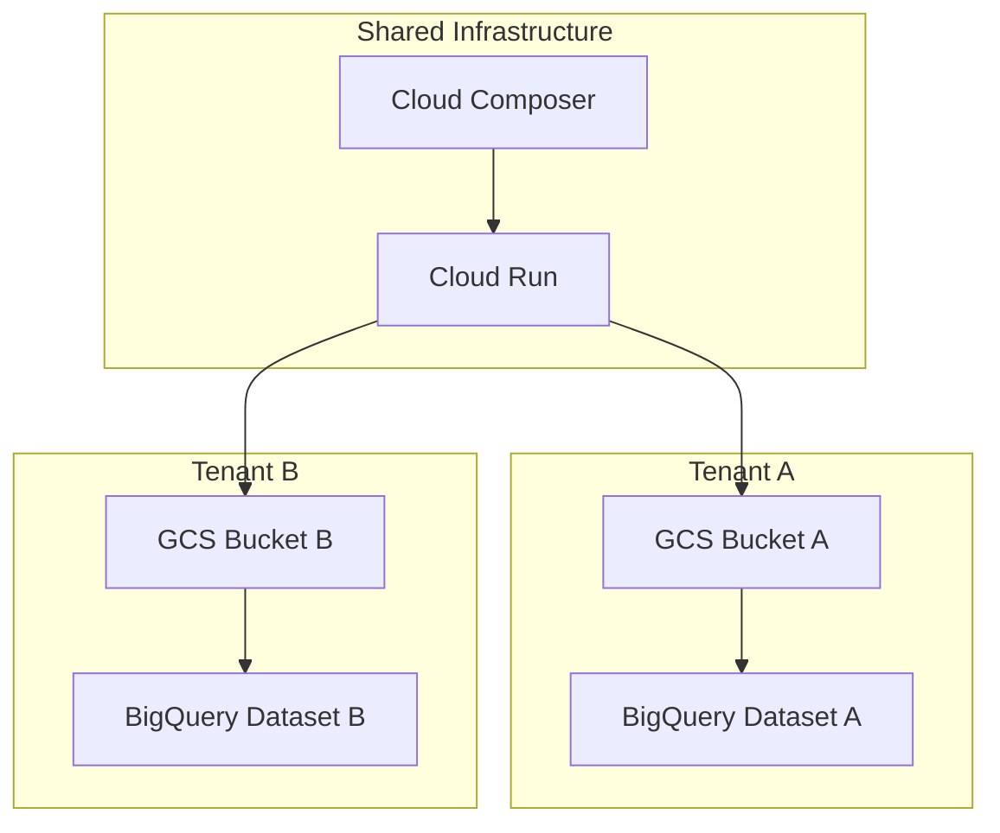
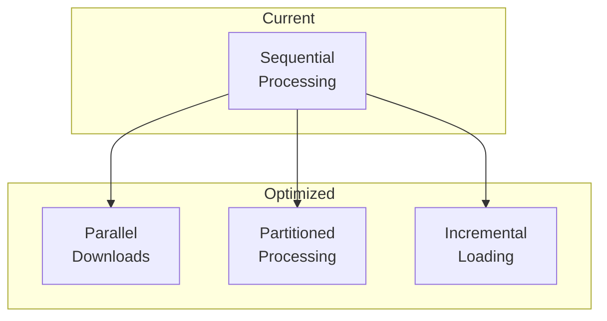

# Limitations and Future Improvements

## Overview

This document outlines the current limitations of the NYC Taxi ETL pipeline and potential improvements for future iterations.

## Current Limitations

### Architecture

| Limitation | Impact | Workaround |
|------------|--------|------------|
| **No Silver Layer** | Direct Bronze → Gold transformation may miss intermediate cleansing steps | Gold layer includes data quality checks |
| **Single Region** | All resources in `us-central1` | Can be extended via Terraform variables |
| **No Real-time Processing** | Batch-only processing | Suitable for historical analysis use case |

### Data Processing



| Limitation | Impact | Potential Solution |
|------------|--------|-------------------|
| **No incremental loading** | Full table scans on each run | Implement watermark-based incremental loads |
| **Limited parallelism** | Sequential month processing | Add parallel processing with Spark partitioning |
| **No data quality framework** | Ad-hoc validation | Integrate Great Expectations or dbt tests |

### Infrastructure

| Limitation | Impact | Potential Solution |
|------------|--------|-------------------|
| **No auto-scaling** | Fixed Cloud Run resources | Implement dynamic scaling based on data volume |
| **No disaster recovery** | Single region deployment | Multi-region GCS replication |
| **No monitoring/alerting** | Manual error detection | Add Cloud Monitoring dashboards and alerts |

### Testing

| Limitation | Impact | Potential Solution |
|------------|--------|-------------------|
| **No integration tests with real GCS** | Mock-only testing | Add integration test suite with test bucket |
| **No load testing** | Unknown performance limits | Implement load tests with large datasets |
| **No data validation tests** | Schema drift undetected | Add schema validation in CI/CD |

## Future Improvements

### Short-term (1-2 Sprints)

#### 1. Add Silver Layer



- Implement intermediate cleansing layer
- Add data quality rules and validation
- Enable reprocessing from Silver without re-ingestion

#### 2. Incremental Loading

```python
# Current: Full load
df = spark.read.parquet(f"gs://{bucket}/gold/fact_trip/")

# Improved: Incremental load with watermark
last_processed = get_watermark("fact_trip")
df = spark.read.parquet(f"gs://{bucket}/gold/fact_trip/") \
    .filter(col("ingestion_timestamp") > last_processed)
```

#### 3. Data Quality Framework

Integrate Great Expectations for automated data validation:

```yaml
# great_expectations/expectations/fact_trip.yml
expectations:
  - expect_column_values_to_not_be_null:
      column: trip_id
  - expect_column_values_to_be_between:
      column: total_amount
      min_value: 0
      max_value: 10000
  - expect_column_values_to_be_in_set:
      column: taxi_type
      value_set: ["yellow", "green"]
```

### Medium-term (1-2 Months)

#### 4. Monitoring and Alerting



Key metrics to track:
- Job execution time
- Records processed per run
- Error rates
- Data freshness (lag)
- Resource utilization
- Avoid hardcoding in dev as it was done that way for this Task

#### 5. CI/CD Enhancements

| Enhancement | Description |
|-------------|-------------|
| **Staging environment** | Add staging between dev and prod |
| **Blue-green deployments** | Zero-downtime deployments |
| **Automated rollback** | Rollback on failed health checks |
| **Performance regression tests** | Detect performance degradation |

#### 6. Cost Optimization

| Area | Current | Improvement |
|------|---------|-------------|
| **GCS Storage** | Standard class | Lifecycle policies (already implemented) |
| **BigQuery** | On-demand | Reserved slots for predictable workloads |
| **Cloud Run** | Always min 0 | Optimize cold start times |
| **Composer** | Small environment | Right-size based on DAG complexity |

### Long-term (3-6 Months)

#### 7. Real-time Processing

Add streaming capability for near real-time analytics:



#### 8. ML Integration

Add machine learning capabilities:

| Use Case | Model | Purpose |
|----------|-------|---------|
| **Demand Forecasting** | Time series (Prophet) | Predict taxi demand by zone |
| **Fare Prediction** | Regression | Estimate fare before trip |
| **Anomaly Detection** | Isolation Forest | Detect unusual patterns |

#### 9. Multi-tenant Support

Enable multiple organizations to use the pipeline:



## Technical Debt

| Item | Priority | Effort | Impact |
|------|----------|--------|--------|
| Refactor duplicate code between dev/prod | High | Medium | Maintainability |
| Add comprehensive logging | Medium | Low | Debugging |
| Implement retry logic for API calls | High | Low | Reliability |
| Add input validation for CLI arguments | Medium | Low | User experience |
| Document all environment variables | Low | Low | Onboarding |

## Security Improvements

| Area | Current State | Improvement |
|------|---------------|-------------|
| **Secrets Management** | GitHub Secrets | Consider Secret Manager |
| **Network Security** | VPC with NAT | Add VPC Service Controls |
| **Data Encryption** | GCS default encryption | Customer-managed keys (CMEK) |
| **Audit Logging** | Basic Cloud Audit Logs | Enhanced logging with BigQuery export |

## Performance Optimization

### Current Bottlenecks

1. **Data Download**: Sequential file downloads from NYC TLC
2. **Spark Processing**: Single-node local mode in dev
3. **BigQuery Loading**: Full table replacement

### Optimization Strategies



| Strategy | Expected Improvement |
|----------|---------------------|
| Parallel downloads | 3-5x faster ingestion |
| Partitioned processing | 2-3x faster transformation |
| Incremental loading | 10x faster for daily loads |

## Related Documentation

- [Architecture](1.ARCHITECTURE.md) - Current system design
- [Terraform](6.TERRAFORM.md) - Infrastructure configuration
- [Data Model](3.DATA_MODEL.md) - Schema design
